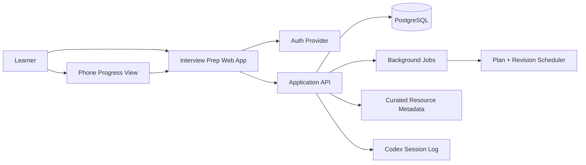
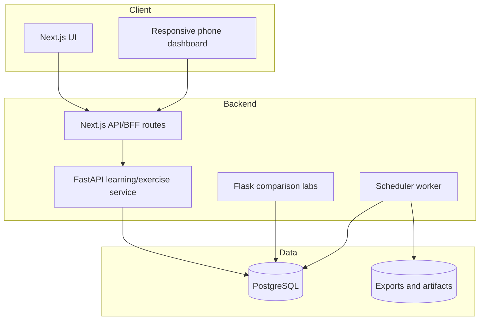
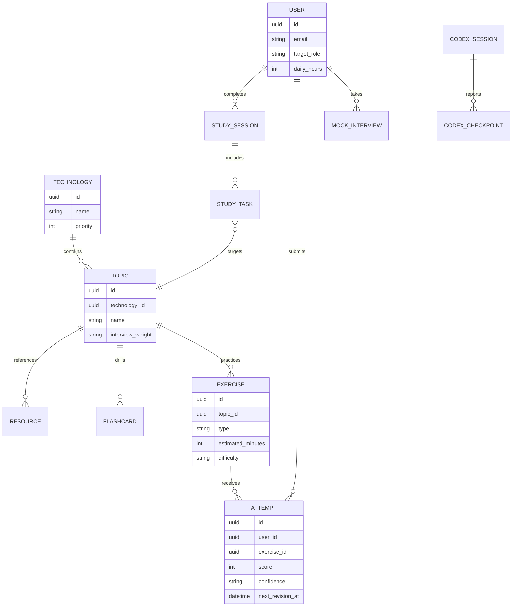
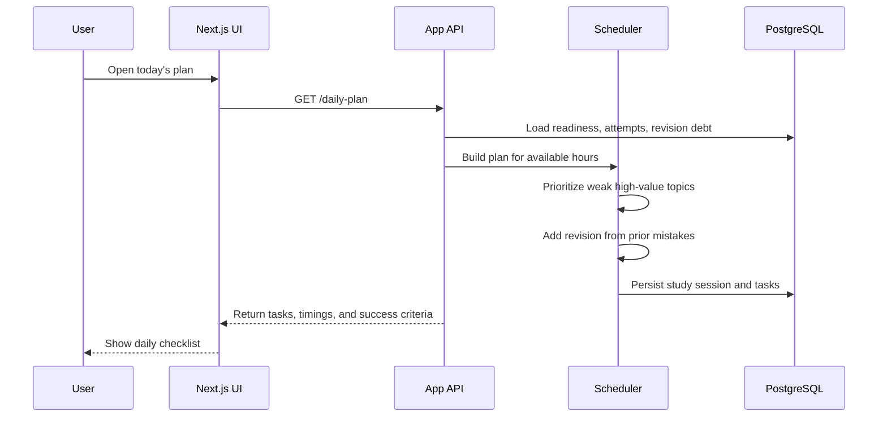
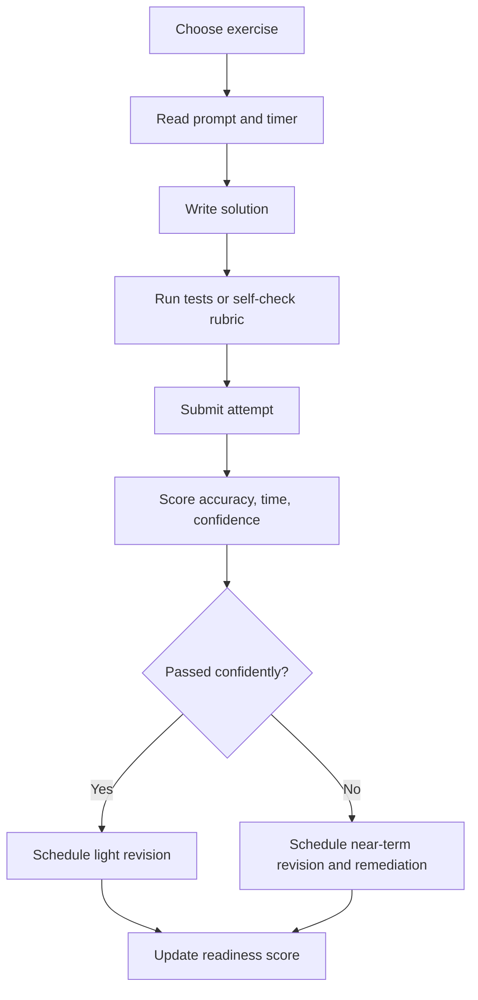
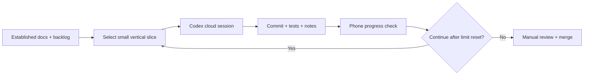

# Architecture, Data Flow, and System Diagrams

## System context

## Container architecture

## Core data model

## Daily plan generation flow

## Exercise attempt flow

## Codex autonomous implementation flow

## Architecture principles

- Keep interview curriculum data separate from presentation so plans can be regenerated.
- Make scheduling/scoring deterministic and testable before adding AI enhancements.
- Use the platform itself as a portfolio project demonstrating React, Next.js, TypeScript, FastAPI, and Flask knowledge.
- Prefer small vertical slices that can be built and reviewed independently by long-running Codex sessions.
