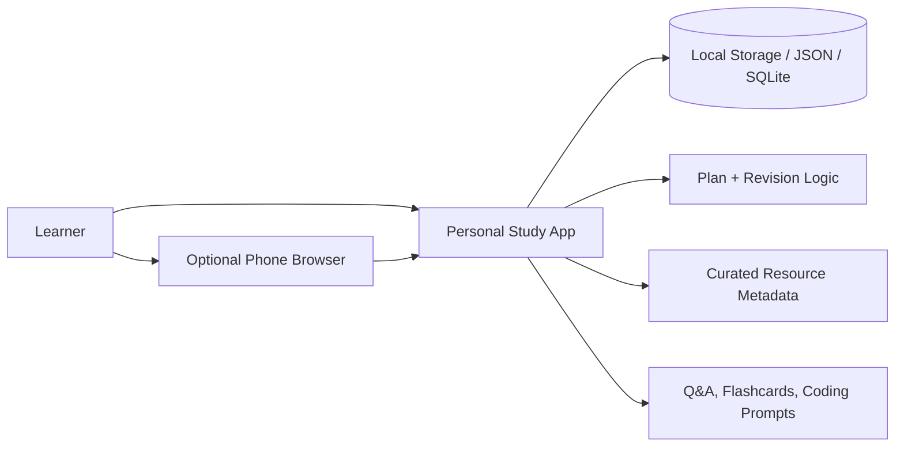
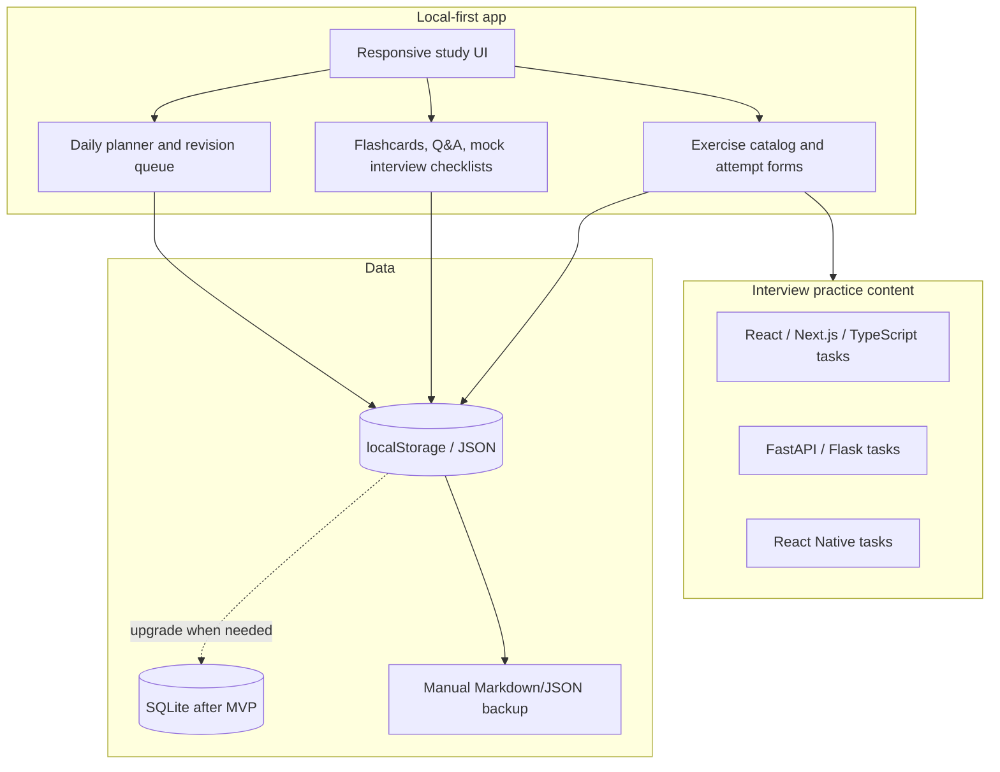
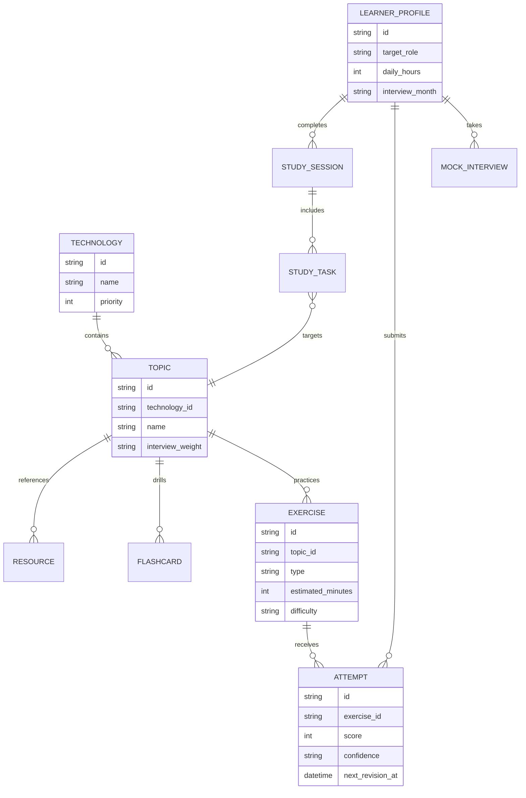
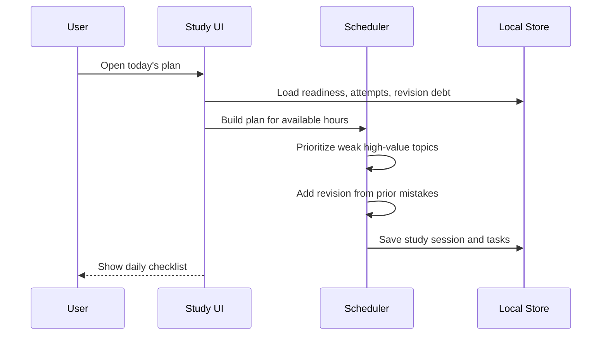
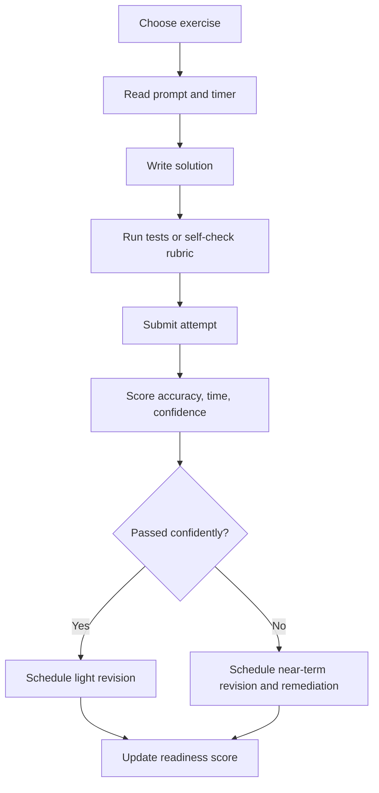
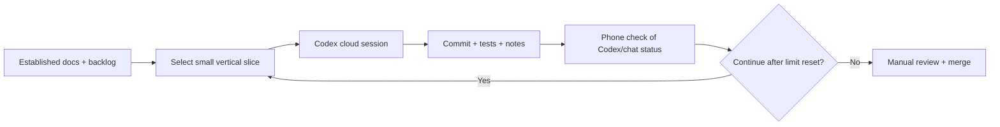

# Architecture, Data Flow, and System Diagrams

## System context

## Container architecture

## Core data model

## Daily plan generation flow

## Exercise attempt flow

## Codex autonomous implementation flow

Codex progress is about building the app, not studying for interviews. It should live in project notes, commits, PRs, or chat updates. The study app may include a small "what changed" note only if that helps the learner know which study features are ready to use.

## Optional AI assistance

AI integrations should support practice, not infrastructure. Good uses are follow-up interview questions, concise answer feedback, weak-topic summaries, and daily-plan adjustments. MVP features should work without AI so the study loop stays reliable.

## Architecture principles

- Keep interview curriculum data separate from presentation so plans can be regenerated.
- Make scheduling/scoring deterministic and testable before considering AI enhancements.
- Use AI only where it directly improves study: generating follow-up questions, drafting answer rubrics, or summarizing weak spots. Keep the learner's active recall and coding practice central.
- Do not add auth, hosted databases, queues, background jobs, or production deployment until a real single-user need appears.
- Prefer small vertical slices that can be built and reviewed independently by long-running Codex sessions.
